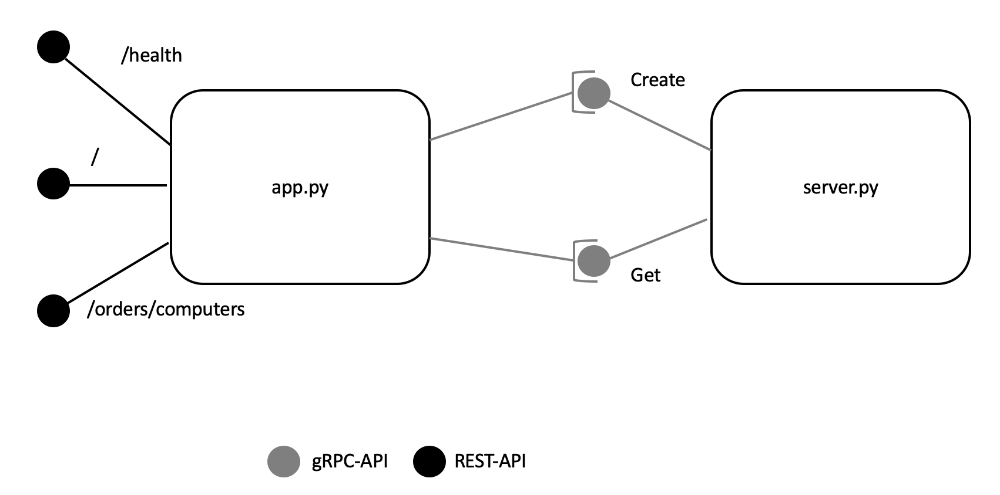
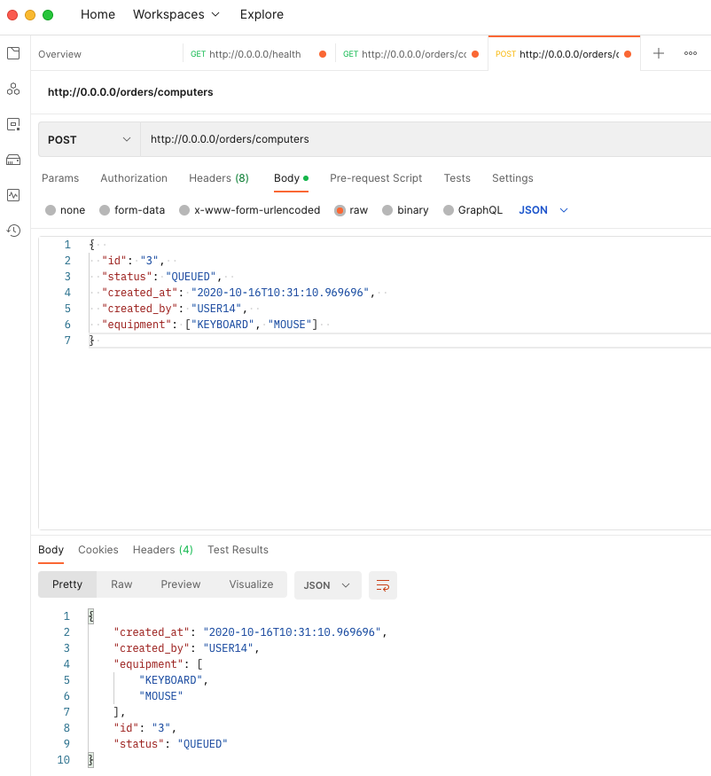

# My-Message-Passing-Cheatsheet
This repository contains a simple client-server application that illustrate how one can work with REST-APIs and gRPC to make microservices communicate with each other. This repository contains an application (file *app.py*) using REST-APIs to communicate with consumers of the service, an ordering system controlling a computer-warehouse serving computers and more hardware. The order-intake system is simulated and has three endpoints: One for checking the health of the server, one for placing and getting orders and one for saying "Hello World!". The simulated backend is a server waiting to process requests (file *server.py*); in a real environment this service could be the one scheduling jobs in a warehouse-system. This microservice is called via remote procedure call (gRPC) inside the application. The following diagram illustrates the architecture.



This reasoning behind this architecture is as follows: Most external consumers of a business enjoy to work with REST-APIs - simply because these are the industry's standard. Well-documented REST-APIs are easy to consume by other applications written in many languages. However, REST-APIs suffer from not being strong with typ-definition and manifesting the structure of the data exchanged. They use HTPP and thus have an overhead of payload compared to binary data transfer enabled by gRPC.

gRPC is very suitable to be used "inside an organization" or "inside an application". A team can share and own the *.proto*-files that define the interior interfaces, generate code for many different languages from these and work with these interfaces in their microservices. The *.proto*-files serve as contracts between different feature teams and make collaboration more transparent as the size and complexity of a multi-container application grows. However, gRPC is not (yet) an industry standard and many consumers (outside of an organization) will refuse to integrate them if being forced to. gRPC have other advantages:
- They are of low latency due to serialization of data and binary transfer. See below hwo to set this up for *server.py*.
- They use HTTP/2 and this improved client-server communication when being compared to earlier versions of this protocol.

This repository is used as a reference (written in Python) that illustrates this reasoning. Please find instructions below on how to deploy and run the client-server-application and how to experience it with [Postman](https://www.postman.com/downloads/).

### The RESTful Endpoint for Health-Checks
The RESTful server implemented in *app.py* responds at the endpoint */health* and returns the number of calls to the primary endpoints. If the primary endpoints have been called previously, the status is considered ok, otherwise the server is waiting.

### The RESTful Endpoint for Placing Orders and Getting the Current Orders
The RESTful server implemented in *app.py* responds at the endpoint */orders/computers* and returns the orders currently stored in the backend as json-output. This is a GET-Method in http.


The RESTful server implemented in *app.py* responds at the endpoint */orders/computers* accepts a json-body like this
```json
{
    "id": "3",
    "status": "QUEUED",
    "created_at": "2020-10-16T10:31:10.969696",
    "created_by": "USER14",
    "equipment": ["KEYBOARD", "MOUSE"]
}
```
to place an order in the backend. This is a POST-Method in http.

## Deployment
To start of we need to install dependencies. A file that holds the dependencies is provided and suitable for passing this to *pip*.
```console
pip install -r requirements.txt
```
Verify that packages are deployed using
```console
pip list
```

### Setup for gRPC-Message-Passing
gRPC tools are installed when running the deployment routines above. To use this method, an interface description is needed. gRPC defines these as human-readable files ending with *.proto*. These files are edited by the developers to define the interfaces in a strict manner. To generate (Python-)code that defines gRPC-services, change into the directory of the clone and then run
```console
python -m grpc_tools.protoc -I./ --python_out=./ --grpc_python_out=./ order.proto
```
This will generate two files: *order_pb2.py* and	*order_pb2_grpc.py*. These are not part of the repository and must be generated before execution.

## Execution
Execution has two steps: Launching *servver.py* and *app.py* in different command windows.
### Launching *server.py*
Open a new terminal. Change into the directory of the clone and then run
```console
python server.py
```
This will start the (gRPC-)server. It will work only if gRPC-interfaces have already been generated as described above.

### Launching *app.py*
Open a new terminal. Change into the directory of the clone and then run
```console
flask run --host=0.0.0.0 --port=80
```
This will start the application. It will work only if gRPC-interfaces have already been generated and *server.py* is running as described above.

The RESTful application can be tested with a client, implemented in *client.py*. However, it is recommended to use [Postman](https://www.postman.com/downloads/), a graphical user interface to test REST-APIs. Using Postman, the POST-request can be tested as shown below.



A browser can also be used to test the GET-Requests: Open a browser and enter the address and port:
* to catch the normal endpoint 0.0.0.0: This will return "Hello World".
* to catch the health check 0.0.0.0/health: This will return the number of calls to the other endpoints as json-output.
To test with a script, in another command window run
```console
python client.py
```
to consume the REST-API with a server. The expected output in the command line here is
```console
{'calls': 0, 'status': 'WAITING'}
```
